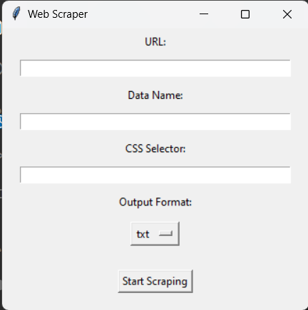

# Web Scraper with GUI

A flexible web scraper with a user-friendly GUI, designed to fetch data based on user-provided CSS selectors from any website.

## Details

This web scraper is developed in Python, leveraging the Scrapy framework for data extraction and tkinter for the GUI. 

### Modules to Install:

- scrapy
- pandas
- urllib
- tkinter
- openpyxl

You can install the required modules using: pip install scrapy pandas openpyxl

## Features

- User-friendly graphical interface.
- Customizable scraping using CSS selectors.
- Supports scraping various data types based on user input.
- Outputs data in `.txt` or `.xlsx` format.
- Automatically names output files based on the domain being scraped.

## Getting Started

1. Clone this repository.
2. Navigate to the directory containing the scraper script.
3. Install the required Python modules.
4. Run the script to open the GUI.

## How to Use

1. Enter the target website's URL.
2. Provide a descriptive name for the data you're extracting.
3. Specify the CSS selector for the data you wish to extract.
4. Choose the desired output format (either `.txt` or `.xlsx`).
5. Click "Start Scraping" and wait for the process to finish.
6. Check the script's directory for the output file.

## Screenshots

## Contributions

Feel free to fork this project and enhance it. Pull requests are welcome. For major changes, please open an issue first to discuss what you'd like to change.

## License

[MIT](https://choosealicense.com/licenses/mit/)

## Acknowledgements

Thanks to the Scrapy and tkinter developers for their excellent tools.